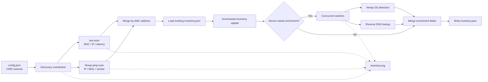
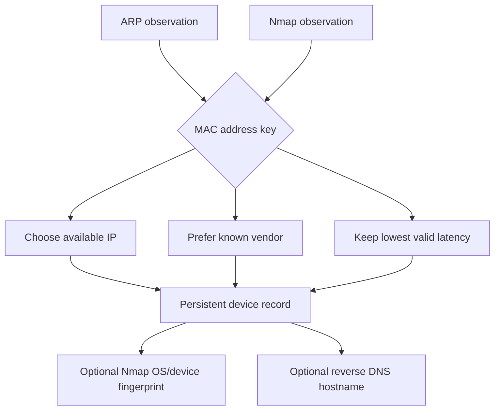

# Windows Discovery

<p align="center">
  <strong>Network discovery and persistent device inventory for local networks</strong><br>
  <sub>Combines ARP discovery, Nmap host detection, reverse DNS, OS fingerprinting, and incremental JSON persistence.</sub>
</p>

<p align="center">
  <a href="https://github.com/paulocfmarques-collab/windows_discovery"></a>
  <a href="https://github.com/paulocfmarques-collab/windows_discovery/blob/main/discovery_windows.py"></a>
  <a href="https://nmap.org/"></a>
  <a href="https://github.com/paulocfmarques-collab/windows_discovery/blob/main/LICENSE"></a>
</p>

---

## Overview

**Windows Discovery** is a lightweight network inventory utility for discovering devices on a local network and enriching each observation with useful identity and reachability data.

The tool runs two complementary discovery passes:

1. **`arp-scan`** quickly identifies local devices by MAC address and IP address.
2. **Nmap** validates host availability and adds latency, vendor, and optional OS/device fingerprints.

Results are merged by MAC address, enriched with reverse DNS, and persisted in `inventory.json`. Existing records are retained so the inventory captures first-seen and last-seen timestamps across executions.

> **Important:** Run scans only on networks you own or are explicitly authorized to assess. OS detection and active network discovery may require elevated privileges and can be considered intrusive in some environments.

## Highlights

- Fast local-network discovery using `arp-scan`.
- Complementary host discovery using `nmap -sn`.
- Optional OS and device-type fingerprinting using Nmap `-O`.
- Reverse DNS hostname resolution.
- Vendor identification when reported by the discovery tools.
- Incremental, MAC-keyed inventory persistence.
- Historical `first_seen` and `last_seen` timestamps.
- Preservation of multiple IP addresses observed for one device.
- Concurrent enrichment with `ThreadPoolExecutor`.
- Structured JSON output suitable for scripts, dashboards, or later database ingestion.
- File-based operational logging through `inventory.log`.

## Architecture



### Runtime sequence

```text
┌──────────────────────┐
│ 1. Read config.json  │
└──────────┬───────────┘
           ▼
┌──────────────────────┐       ┌──────────────────────┐
│ 2. arp-scan          │       │ 3. nmap -sn          │
│    Fast local scan   │       │    Host discovery     │
└──────────┬───────────┘       └──────────┬───────────┘
           └──────────────┬───────────────┘
                          ▼
              ┌──────────────────────┐
              │ 4. Merge observations│
              │    by MAC address    │
              └──────────┬───────────┘
                          ▼
              ┌──────────────────────┐
              │ 5. Update persistent │
              │    inventory         │
              └──────────┬───────────┘
                          ▼
              ┌──────────────────────┐
              │ 6. Enrich in parallel│
              │    Nmap -O + DNS     │
              └──────────┬───────────┘
                          ▼
        ┌─────────────────┴─────────────────┐
        ▼                                   ▼
┌───────────────────┐              ┌───────────────────┐
│ inventory.json    │              │ inventory.log     │
│ Durable inventory │              │ Execution trace   │
└───────────────────┘              └───────────────────┘
```

## Data flow and merge strategy

Each discovery backend contributes partial observations. The application normalizes those observations into a single device record:



### Identity and retention rules

| Field | Behavior |
|---|---|
| `mac` | Primary device identity and inventory key. |
| `ip` | Uses the newest available address; previous addresses may be retained as a list. |
| `vendor` | A known vendor replaces `Missing` or `Unknown`. |
| `latency` | The lowest valid latency observed is retained. |
| `first_seen` | Set only when a device is first added. |
| `last_seen` | Updated whenever the device is observed again. |
| `hostname` | Filled through reverse DNS when available. |
| `device_type` | Enriched through Nmap OS detection when unknown. |
| `os` | Enriched through Nmap OS detection when unknown. |

## Repository layout

```text
.
├── discovery_windows.py   # Discovery, merge, enrichment, and persistence workflow
├── requirements.txt       # Python dependencies
├── config.json            # Local configuration; create this file yourself
├── inventory.json         # Generated persistent inventory; not required initially
└── inventory.log          # Generated execution log
```

## Prerequisites

### Software

- Python 3.x
- [Nmap](https://nmap.org/)
- [arp-scan](https://github.com/royhills/arp-scan)
- Permission to inspect the target network

The Python dependency currently pinned by the project is:

```text
prometheus_client==0.26.0
```

> `arp-scan` is primarily used on Linux and Linux-based appliances. On Windows, use an environment where both required command-line tools are available, such as WSL or a compatible Linux host, and verify the commands are present on `PATH`.

### Debian / Ubuntu / Raspberry Pi OS

```bash
sudo apt update
sudo apt install -y python3 python3-pip nmap arp-scan
```

Verify the installation:

```bash
python3 --version
nmap --version
arp-scan --version
```

## Installation

```bash
git clone https://github.com/paulocfmarques-collab/windows_discovery.git
cd windows_discovery
python3 -m venv .venv
source .venv/bin/activate
python -m pip install --upgrade pip
python -m pip install -r requirements.txt
```

On Windows PowerShell, activate the virtual environment with:

```powershell
.venv\Scripts\Activate.ps1
```

## Configuration

Create `config.json` in the repository root:

```json
{
  "windows": {
    "network": "192.168.1.0/24"
  }
}
```

Replace the example CIDR range with the network you are authorized to scan. The current implementation reads the `network` value from the `windows` section.

## Usage

Standard execution:

```bash
python3 discovery_windows.py
```

Verbose execution, useful during setup and troubleshooting:

```bash
python3 discovery_windows.py --verbose
```

Equivalent short form:

```bash
python3 discovery_windows.py -v
```

A successful run produces or updates:

- `inventory.json` — persistent device inventory.
- `inventory.log` — timestamped execution and error messages.

## Output schema

Example record from `inventory.json`:

```json
{
  "AA:BB:CC:DD:EE:FF": {
    "first_seen": "2026-08-19 08:00:00",
    "last_seen": "2026-08-19 09:00:00",
    "mac": "AA:BB:CC:DD:EE:FF",
    "ip": "192.168.1.10",
    "latency": 0.012,
    "vendor": "Raspberry Pi",
    "hostname": "raspberry.local",
    "device_type": "general purpose",
    "os": "Linux"
  }
}
```

Values such as vendor, hostname, OS, device type, and latency can be unavailable depending on network permissions, tool output, firewall behavior, and the capabilities of the target device.

## Operational considerations

### Permissions

- ARP-based discovery generally requires access to the local Layer-2 network.
- Nmap OS detection may require administrator/root privileges.
- Firewalls and segmented networks can prevent host discovery or reverse DNS resolution.

### Performance

- Host discovery is performed sequentially by the two scanners.
- Device enrichment uses up to 20 worker threads.
- Nmap OS fingerprinting is attempted only when OS or device information is unknown.
- Large CIDR ranges may increase scan time and generate substantial network traffic.

### Data protection

The generated files may contain network topology, MAC addresses, hostnames, and OS details. Treat `inventory.json` and `inventory.log` as sensitive operational data and apply appropriate access controls before sharing or publishing them.

## Troubleshooting

| Symptom | Checks |
|---|---|
| `config.json` not found | Create it in the directory from which the script is executed and confirm the `windows.network` key exists. |
| `arp-scan: command not found` | Install `arp-scan` and confirm it is available on `PATH`. |
| `nmap: command not found` | Install Nmap and confirm `nmap --version` works. |
| No devices discovered | Validate the CIDR range, local network placement, privileges, and firewall rules. |
| Hostname is `null` | Reverse DNS may not be configured or the target may not expose a resolvable hostname. |
| OS remains `Unknown` | Try an elevated execution and confirm the target permits the probes required by Nmap. |
| Scan takes too long | Start with a smaller authorized CIDR range and inspect `inventory.log` for timeouts. |

## Security and responsible use

This project performs active network discovery and OS fingerprinting. Use it only:

- On networks you own or have explicit permission to assess.
- In accordance with organizational security policies.
- With an appropriately scoped CIDR range.
- In a way that avoids disrupting production systems.

Do not use the tool to evade access controls, probe third-party infrastructure, or collect information without authorization.

## Roadmap

- [ ] Add automated tests for parser, merge, and inventory-update behavior.
- [ ] Add explicit command availability and configuration validation.
- [ ] Add structured logging and configurable output paths.
- [ ] Export inventory to PostgreSQL or another durable datastore.
- [ ] Add Prometheus metrics and a Grafana dashboard.
- [ ] Provide a REST API for inventory queries.
- [ ] Add configurable alerting integrations.
- [ ] Track field-level inventory changes over time.

## Contributing

1. Create a feature branch.
2. Make focused, documented changes.
3. Test against a controlled network or mocked command output.
4. Update this README when behavior or configuration changes.
5. Open a pull request describing the change, validation performed, and any operational impact.

## License

No license file is currently present in the repository. Until a license is added, assume that all rights are reserved and obtain permission before redistributing or modifying the project.

## Author

**Paulo César Furlanetto Marques**

---

<p align="center">
  <sub>Discover responsibly. Inventory deliberately. Operate with authorization.</sub>
</p>
